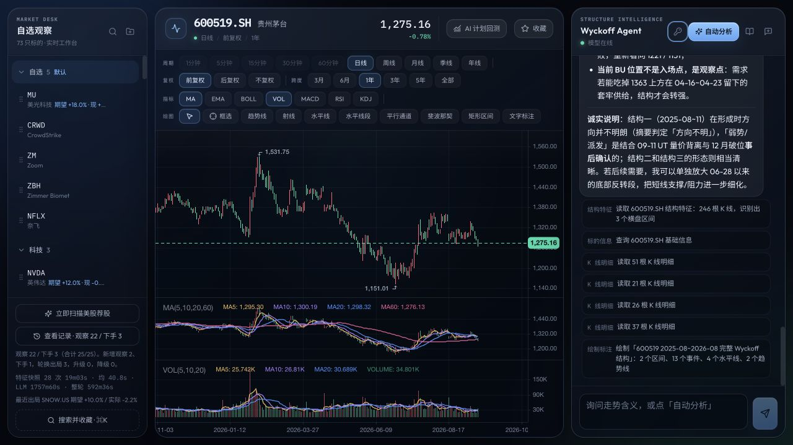
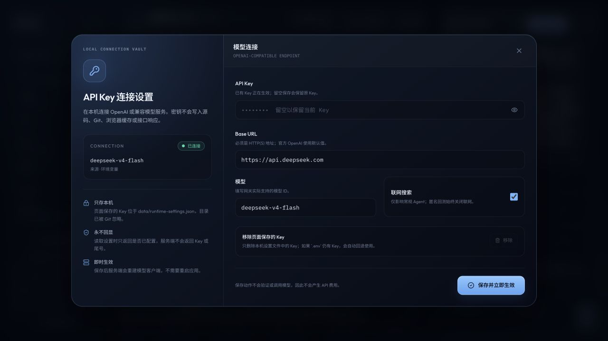
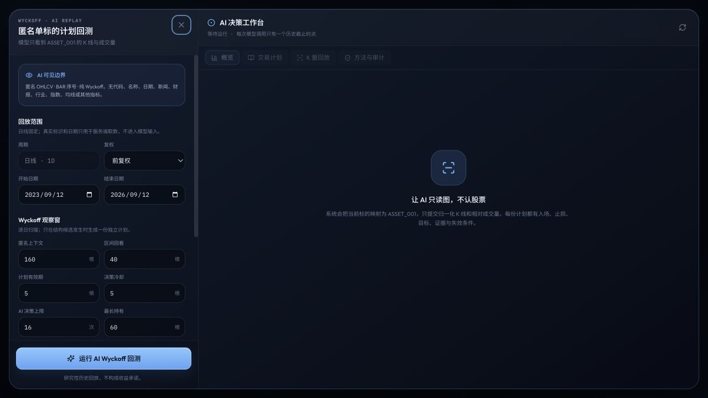

# Wyckoff Agent Workbench

**English** · [简体中文](./README.md)

A local AI workspace for single-asset price-and-volume research: professional candlestick charts, Wyckoff structure analysis, semantic annotations, anonymous AI plan backtesting, and auditable deterministic trade replay.

> This project is for research and education. It is not investment advice, a performance guarantee, or an automated trading service.



## Why this project exists

Many technical-analysis products mix indicators, stock selection, rotation, model opinions, and execution rules into one opaque score. This workbench separates the workflow into three explicit layers:

1. **Facts**: candlesticks, volume, swing points, and trading ranges.
2. **Interpretation**: AI explains Wyckoff phases, events, and price-volume evidence.
3. **Execution**: deterministic code handles triggers, sizing, costs, stops, and exits.

Every conclusion can therefore be traced to specific bars, and every plan can be replayed on historical data.

## Highlights

- **Professional chart workspace** with zooming, panning, crosshair, timeframes, adjustments, indicators, and drawing tools.
- **Wyckoff Agent** for Phase A–E and events such as SC, AR, ST, Spring, SOS, LPS, UTAD, and SOW, rendered directly on the chart.
- **Anonymous AI backtesting** where one stock becomes `ASSET_001` and the model receives only normalized daily OHLCV and anonymous BAR identifiers.
- **A plan for every reviewed point**: observe, enter, or exit, including entry, stop, target, evidence, missing confirmation, and invalidation conditions.
- **Deterministic replay** from the next bar onward, including position sizing, commissions, slippage, maximum holding period, stop/target handling, and China A-share T+1.
- **Full audit trail** with prompt version, model, anonymous-input hash, token usage, latency, cache hits, protocol failures, and a data fingerprint.
- **Local API Key settings** that take effect immediately without manually editing configuration files; keys are never returned by the API.
- **Search, favorites, and groups** using symbol, company name, or Chinese pinyin initials.

## Product views

| Local API Key settings | Anonymous AI plan backtest |
| --- | --- |
|  |  |

## How anonymous AI backtesting works

```text
Single-asset historical OHLCV
        ↓
Causal candidate scan using only information available at that point
        ↓
Remove symbol, name, exchange, and dates; normalize price and volume
        ↓
Run one isolated, pure-Wyckoff AI review per decision point
        ↓
Validate BAR evidence, phase, event, plan type, and price boundaries
        ↓
Execute plans bar by bar with a deterministic engine
        ↓
Equity curve, trades, plan states, and complete audit data
```

The model cannot see:

- the ticker, company name, or exchange;
- dates, news, earnings, sector, index, or macro information;
- moving averages, MACD, RSI, KDJ, Bollinger Bands, ATR, or other indicators;
- any bar after the current historical decision point.

The model interprets structure only. It cannot control sizing, fees, or fills. Invalid model output is not repeatedly sampled until a favorable answer appears, and it never creates a synthetic trade.

## Quick start

### Requirements

- Node.js 20.11 or later
- pnpm 9

### Install and run

```bash
pnpm install
cp .env.example .env
pnpm dev
```

- Web app: <http://127.0.0.1:5273>
- API server: <http://127.0.0.1:8787>
- Wyckoff method reference: <http://127.0.0.1:5273/wyckoff.html>

On first launch, the app syncs its instrument index into local SQLite. The free TickFlow endpoint requires no key but supports daily and higher timeframes only.

## Configure an API Key

Recommended: launch the app, click the key icon in the Agent header, and configure:

- an OpenAI or OpenAI-compatible API Key;
- the Base URL;
- the model ID;
- whether the regular Agent may use web search.

Settings saved from the page live in `data/runtime-settings.json` and take effect immediately. The password field is never prefilled, and the API never returns the key.

You can also use a root `.env` file:

```env
OPENAI_BASE_URL=https://api.openai.com/v1
OPENAI_API_KEY=
OPENAI_MODEL=gpt-4o
OPENAI_WEB_SEARCH=1
```

A non-empty key saved by the page overrides `.env`. Removing the page-saved key automatically falls back to the environment value.

## Key security

- `.env`, `.env.*`, `data/`, databases, build output, and local caches are excluded by `.gitignore`.
- `.env.example` contains an empty key and safe defaults only.
- The local settings file is written atomically and forced to permission mode `0600`.
- Keys never enter Zustand, `localStorage`, `sessionStorage`, URLs, logs, or API responses.
- The service binds to `127.0.0.1`, and the write endpoint accepts only strictly validated JSON.

If a key has ever been committed, included in a screenshot, pasted into an issue, or sent to an untrusted service, adding it to `.gitignore` is not sufficient. Revoke and rotate it immediately at the provider.

## Environment variables

| Variable | Default | Purpose |
| --- | --- | --- |
| `TICKFLOW_BASE_URL` | `https://free-api.tickflow.org` | TickFlow market-data endpoint |
| `TICKFLOW_API_KEY` | empty | Paid data key for intraday and real-time capabilities |
| `OPENAI_BASE_URL` | `https://api.openai.com/v1` | OpenAI-compatible API endpoint |
| `OPENAI_API_KEY` | empty | Model key; it can also be configured in the UI |
| `OPENAI_MODEL` | `gpt-4o` | Model ID |
| `OPENAI_WEB_SEARCH` | `1` | Enables Responses `web_search` for the regular Agent; anonymous backtests always disable it |
| `RECOMMEND_ENABLED` | `1` | Enables the post-close US stock scan |
| `RECOMMEND_CONCURRENCY` | `3` | Concurrent recommendation reviews |
| `SMTP_*` / `MAIL_TO` | empty | Optional email delivery |
| `PORT` | `8787` | API server port |
| `DATA_DIR` | `./data` | Local SQLite and runtime-settings directory |

See [`.env.example`](./.env.example) for the complete template.

## Commands

```bash
pnpm dev          # run web and API services
pnpm typecheck    # TypeScript checks for the whole workspace
pnpm test         # all tests
pnpm lint         # ESLint
pnpm build        # production web build
```

## Repository layout

```text
apps/web                 React + Vite product UI
apps/server              Hono API, model calls, jobs, and SQLite
packages/shared          Shared types, Zod protocols, and API contracts
packages/wyckoff         Features, structures, candidate scan, and backtest engine
docs/screenshots         README product screenshots
data                     Local database and runtime keys (Git ignored)
```

## Implementation principles

- The Agent returns domain semantics rather than pixel coordinates; the frontend maps them onto chart overlays.
- Anonymous backtest plans are created after a bar closes and can trigger no earlier than the next bar, preventing look-ahead execution.
- If a daily bar touches both stop and target, the conservative stop-first assumption is used because intrabar order is unknowable.
- Shanghai, Shenzhen, and Beijing stocks follow a T+1 rule: a position cannot be exited on its entry bar.
- Identical model, prompt version, and anonymous input reuse cached decisions to reduce repeated cost.
- AI plan backtest endpoints live under `/api/wyckoff-ai-backtests`; local connection settings live under `/api/settings`.
